```{r setup, include=FALSE}
library(tidyverse)
library(gtsummary)
```

## Motivation

- The onset of COVID-19 affected almost every sphere of work and leisure.

- We are interested in investigating the impact athletic identity may have on athletes' overall well-being, particularly as the context of a global pandemic may have dramatically impacted one's experience of playing a sport/being an athlete.

<!-- The sudden outbreak of COVID-19 was unexpected to everyone. According to an article written by Healeem et al. in 2020, the COVID-19 has rapidly affected our day to day life, businesses, disrupted the world trade and movements. As informed biostatistics students, we are specifically interested to investigate people's mental health conditions or wellbeing under the COVID-19 lockdown period and whether there are any potential factors that may affect them. -->

## Resilience, Healthy Lifestyle, and Mental Health

- Resilience and healthy lifestyle are both characteristics that are associated with improved mental health. 

- We hypothesize that the effect that being a devoted athlete has on overall well-being would be mediated through these two characteristics, and will endeavor to investigate the relationships between these variables as well.

## Methodology

1. Conduct EFA and CFA to determine which observed variables underlie our latent variables of interest.
2. Evaluate reliability of the determined latent structures with Chronbach's alpha.
2. Construct SEM(s) to quantify the relationship between our constructed latent variables and mental health score.

<!-- We decide to focus on a particular group people -- athletes. Our hypothesis is that during the COVID-19 lockdown period, there is a negative correlation between athlete identity and wellbeing, and this effect might also be mediated by their resilience and healthy lifestyle. -->

## Data: Athlete Mental Health Survey

The dataset we selected contains responses for several surveys administered in the UK to assess athlete (and non-athlete) mental health and well-being after the country's first COVID-19 lockdown.

These surveys include:

- Athletic Identity Scale (AIMS)

- The Brief Resilience Scale

- Mental Health Continuum Short Form (MHC-SF)

In total, 753 individuals were interviewed -- we will focus our analysis on the 363 athletes represented in this study. 

## Latent Variable 1: Athletic Identity

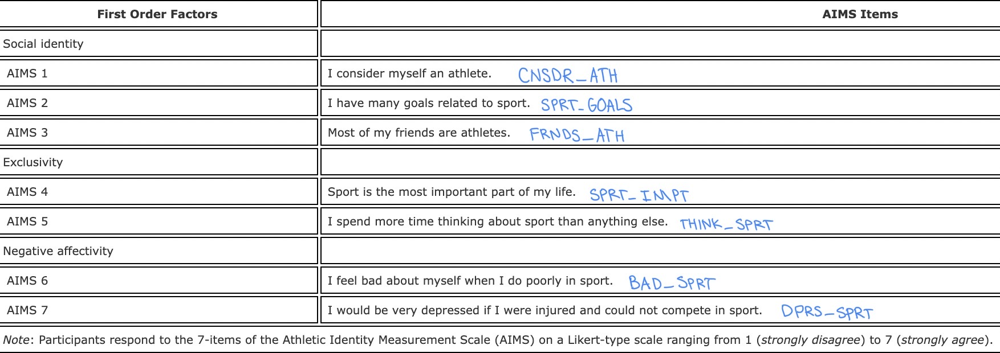

## Latent Variable 1 (Athletic Identity): EFA

After conducting EFA, we first propose that there are three latent variables underlying the AIMS variables, structured as follows:

- `external_identity` (comprised of `sprt_goals`, `cnsdr_ath`, `frnds_ath`)
- `internal_value` (comprised of `sprt_impt`, `think_sprt`)
- `negative_events` (comprised of `dprs_sprt`, `bad_sprt`)

## Latent Variable 1 (Athletic Identity): Reliability

Chronbach's alpha were reasonable for `internal_value` and `negative_events` (0.81 and 0.63, respectively), with no variables indicated that could be dropped to improve reliability.

However, for `external_identity`:

\centering
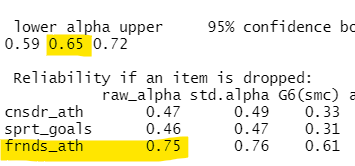

Since Chronbach's alpha for `external_identity` would improve significantly if `frnds_ath` is removed, we decided to remove this variable from the latent structure.

## Latent Variable 1 (Athletic Identity): CFA

We hypothesized that there exists a second-order latent variable, `athletic_identity`, underlying the latent variables `external_identity`, `internal_value`, and `negative_events`. Conducting a CFA allows us to evaluate this hypothesis:

\centering
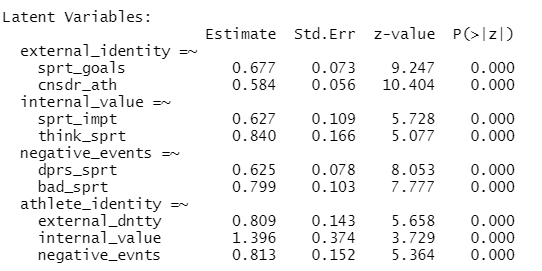

Fit statistics: CFI > 0.99, RMSEA < 0.05, $\chi^2$ = 0.514
<!--Both the first- and second- order latent variables report significant loadings. As fit statistics are also adequate (CFA > 0.99, RMSEA < 0.05, $\chi^2$ = 0.514), we will proceed with this structure in our SEM. -->

## Latent Variable 2: Resilience

\centering
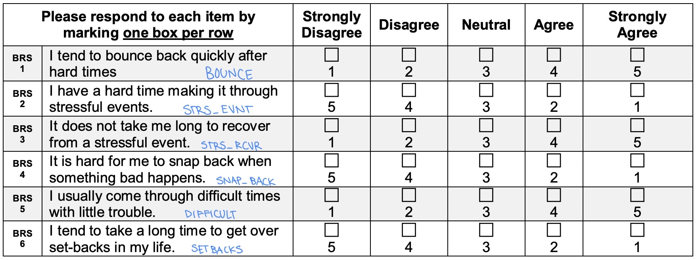

## Latent Variable 2 (Resilience): EFA

After running EFA on 1- and 2- factor models, we find that the 1-factor model, containing all variables from the scale fits the best.

## Latent Variable 2 (Resilience): Reliability

\centering
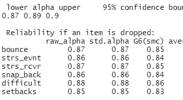

<!--No items can be dropped to improve this measure, so we will keep all of them in this latent variable.-->

## Latent Variable 2 (Resilience): CFA

\centering
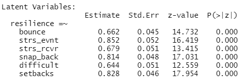

Fit statistics: CFI > 0.98, RMSEA < 0.08, $\chi^2$ = 0.017
<!--Loadings are all significant. As fit statistics are adequate (CFI > 0.98, RMSEA < 0.08, though $\chi^2$ = 0.017), we will proceed with this structure in our SEM.-->

## Latent Variable 3: Healthy Lifestyle

We hypothesized that we could create a latent variable representing a healthy lifestyle using the following variables:

- `fruit_veg`: Five Fruit and Vegetables (Yes/No)

- `smoking`: Smoking Status (7-point Likert scale)

- `hr_sleep`: Hour Sleep (numeric variable)


## Latent Variable 3 (Healthy Lifestyle): Reliability

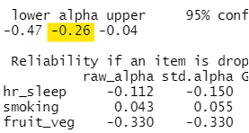

Chronbach's alpha is very low for these variables, indicating that the variables `hr_sleep`, `smoking`, `fruit_veg` do not reliably measure the latent variable. 

Since `healthy_lifestyle` is thus not reliably measured with these variables, we made the decision to exclude this latent variable from SEM analysis -- treating this latent variable as a formative (rather than a reflective) construct might more accurately reflect its nature.


<!-- ## Exploratory Analysis

- MHC-SF:

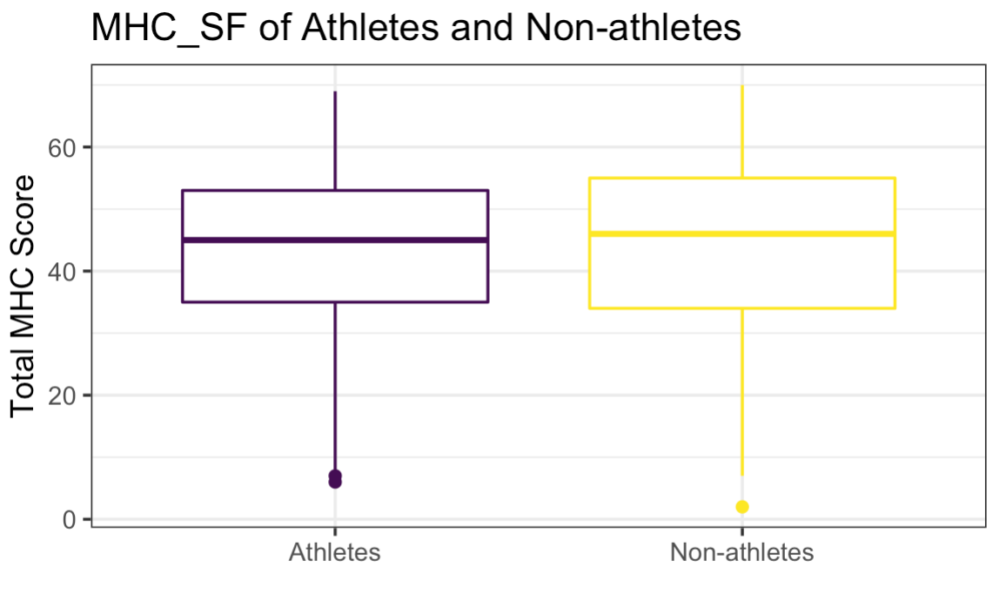

## Exploratory Analysis

The side-by-side boxplot of MHC-SF score between athletes and non-athletes shows that these two groups have approximately the same median/mean and distribution of MHC-SF score. Both distributions are left-skewed, with a couple of outliers in the negative direction.

## Exploratory Analysis

- Resilience

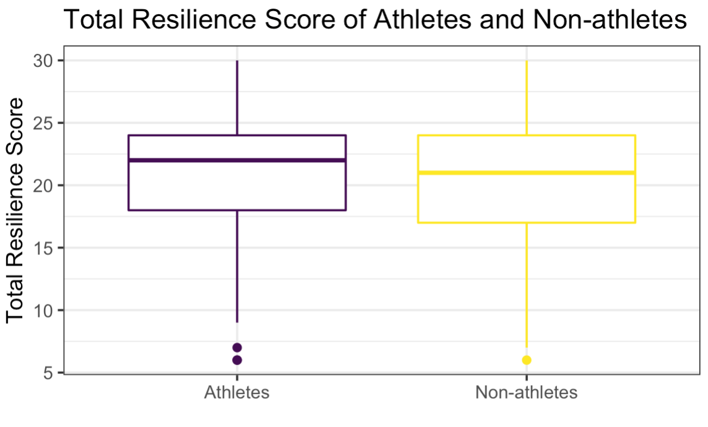

## Exploratory Analysis

The side-by-side boxplot of resilience score between athletes and non-athletes shows that athletes have a slightly larger median/mean resilience score than non-athletes. Both distributions are left-skewed, with a couple of outliers in the negative direction.
-->


## Outcome Variable: Mental Health Continuum Short Form (MHC-SF)

\centering
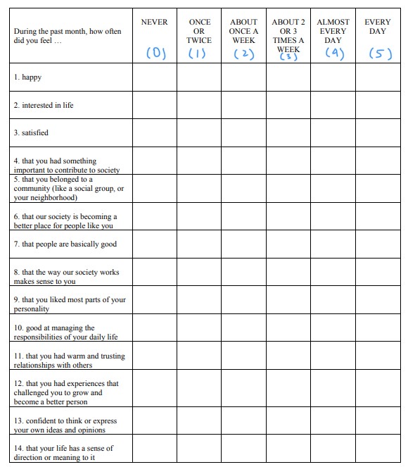

## Outcome Variable: MHC-SF

Three components of well-being are assessed:

- Emotional
- Social
- Psychological

We will use the MHC-SF composite score (sum of all responses) as our outcome variable. Higher scores indicate greater levels of positive well-being.

## SEM 1: Athletic Identity and MHC-SF 

First, we constructed a SEM relating athletic identity to MHC-SF, without any mediating variable.

\centering
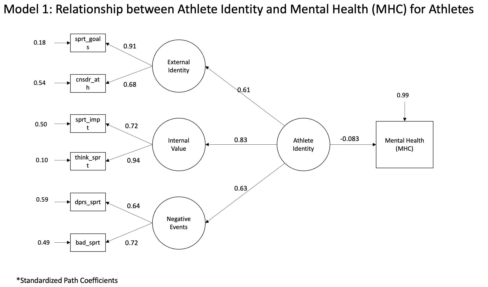

## SEM 1: Athletic Identity and MHC-SF

We found that though the estimated effect between athletic identity and MHC-SF is negative, indicating that a stronger athletic identity decreases overall well-being, the p-value associated with this value is 0.232.

Therefore, we conclude that there is **no** significant relationships between athletic identity and overall well-being

## SEM 2: Resilience, Athletic Identity, and MHC-SF

We constructed another SEM to investigate the mediation effect of Resilience on causal relationship between athletic identity and MHC-SF.

\centering
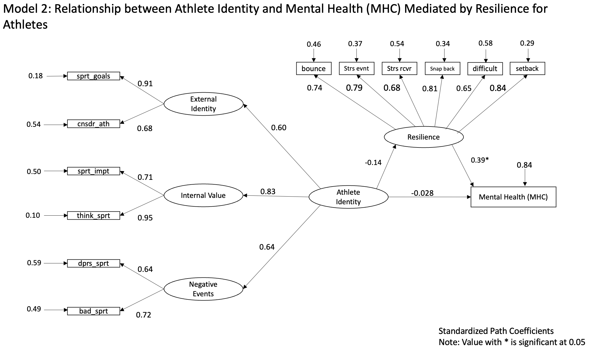

## SEM 2 : Conclusion

## SEM2: Resilience, Athletic Identity, and MHC-SF

We found that estimated effect between athletic identity and resilience is negative, indicating that stronger athletic identity increases resilience. Such effect is not significant. 

The estimated effect between resilience and MHC-SF is positive, indicating that stronger resilience increases overall well-being. Such effect is significant at 0.05 significant level.

<<<<<<< HEAD
The indirect effect of athletic identity on MHC-SF through its effect on resilience is 0.14*0.39 = 0.0546. This indicates that increasing resilience by 0.39 leads to a 0.0546 increase in MHC-SF.
=======
\centering
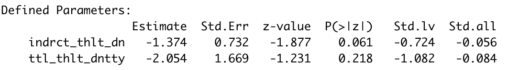

- Both direct and indirect effects are not significant


## Comparison of Athletes and Non-athletes

- We are interested in comparing mediation effects of resilience on relationship between athletic identity and MCH-SF within athlete group and non-athlete group

\centering
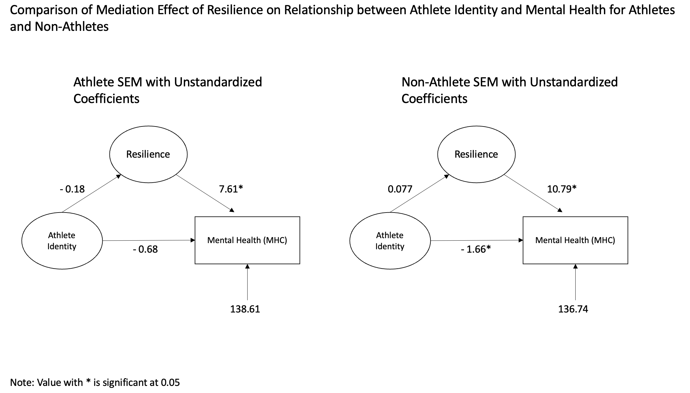

## Comparsion of SEM within Athletes and Non-athletes: Conclusion
- We found that the estimated effect between athletic identity and MHC-SF is stronger among non-athletes compared to athletes. Such effect is significant.

- Direct/Indirect effect of athletic identity among athletes
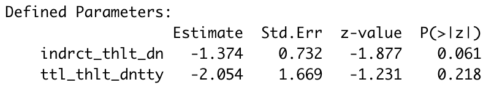
- Direct/Indirect effect of athletic identity among non-athletes
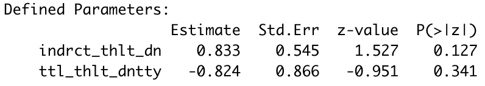


>>>>>>> ff3cd52c6319f990b80ad56c2587ceef5fd6632f

## Resources 

1. Hu, T., Zhang, D., &amp; Wang, J. (2014, December 13). A meta-analysis of the Trait Resilience and Mental Health. Personality and Individual Differences. https://www.sciencedirect.com/science/article/pii/S0191886914006710 

2. Dale, H., Brassington, L., &amp; King, K. (2014, March 5). The impact of healthy lifestyle interventions on Mental Health and Wellbeing: A systematic review. Mental Health Review Journal. https://www.emerald.com/insight/content/doi/10.1108/MHRJ-05-2013-0016/full/html 

3. A cross-cultural psychometric evaluation of the Athletic Identity Measurement Scale. Taylor &amp; Francis. (n.d.). https://www.tandfonline.com/doi/full/10.1080/10413200802415048

4. The brief resilience scale. Evaluating wellbeing. (2021, March 15). https://measure.whatworkswellbeing.org/measures-bank/brief-resilience-scale/ 

## Resources

5. Fung S. F. (2020). Validity of the Brief Resilience Scale and Brief Resilient Coping Scale in a Chinese Sample. International journal of environmental research and public health, 17(4), 1265. https://doi.org/10.3390/ijerph17041265

6. Mental health continuum short form. Lee Kum Sheung Center for Health and Happiness. (2022, March 16). Retrieved May 3, 2022, from https://www.hsph.harvard.edu/health-happiness/mental-health-continuum-short-form/ 
