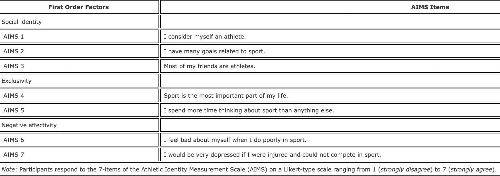
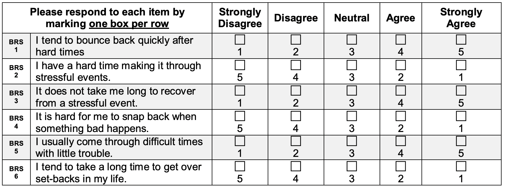

```{r setup, include=FALSE}
library(tidyverse)
library(gtsummary)
```

## Motivation
- The sudden outbreak of COVID-19 was unexpected to everyone. According to an article written by Healeem et al. in 2020, the COVID-19 has rapidly affected our day to day life, businesses, disrupted the world trade and movements. As informed biostatistics students, we are specifically interested to investigate people's mental health conditions or wellbeing under the COVID-19 lockdown period and whether there are any potential factors that may affect them.


## Goal
- We decide to focus on a particular group people -- athletes. Our hypothesis is that during the COVID-19 lockdown period, there is a negative correlation between athlete identity and wellbeing, and this effect might also be mediated by their resilience and healthy lifestyle.

## Data 
- Athlete Mental Healthy Survey collected in the UK after the first COVID-19 lockdown using non-athletes as comparison
- Focus on athletic identity, resilience, wellbeing, and healthy lifestyle
- Athletic Identity Scale, The Brief Resilience Scale, The Mental Health Continuum Short Form
- 753 Observations (363 athletes, 390 non-athletes) 

## Athletic Identity Scale (AIMS)
- Abbreviated 7-item AIMS$^1$



- First-order factors (Social Identity, Exclusivity, Negative Affectivity) are subordinated to a higher-order Athletic Identity Factor

## AIMS (Continued)
- Result of the confirmatory factor analysis of AMIS with athletes in data
- (insert CFA graph)
- Chronbach's alpha is 0.74, with a 95 \% confidence interval of (0.70, 0.78).

## The Brief Resilience Scale
- Assess the ability to bounce back or recover from stress$^2$

- Higher the sum score of responses indicates higher level of resilience

## The Brief Resilience Scale (Continued)
1-factor CFA
-CFI 0.999
-P value = 0.110
- test statistics = 14.376
- RMSEA 0.043

## The Mental Health Continuum Short Form (MHC-SF)
- Assess three components of well-being: emotional, social, and psychological$^4$
- Total score ranging from 0 to 70
- Higher scores indicate greater levels of positive well-being

## Healthy Lifestyle
- Formative Measurement: a composite of observed variables
- Indicators of healthy lifestyle

1. Five Fruit and Vegetables: Yes/No

2. Smoking Status: 7-point Likert scale

3. Hour Sleep: numerical variable

- Higher sum score indicates healthier lifestyle

## Exploratory Analysis

- MHC-SF:
The side-by-side boxplot of MHC-SF score between athletes and non-athletes shows that these two groups have approximately the same median/mean and distribution of MHC-SF score. Both distributions are left-skewed, with a couple of outliers in the negative direction.

## Selected Variables

## Discussion 


## Resources 
1.https://www.tandfonline.com/doi/full/10.1080/10413200802415048
2.https://measure.whatworkswellbeing.org/measures-bank/brief-resilience-scale/
3.https://www.ncbi.nlm.nih.gov/pmc/articles/PMC7068432/#B17-ijerph-17-01265
4.https://www.hsph.harvard.edu/health-happiness/mental-health-continuum-short-form/
5.https://www.ncbi.nlm.nih.gov/pmc/articles/PMC7147210/
