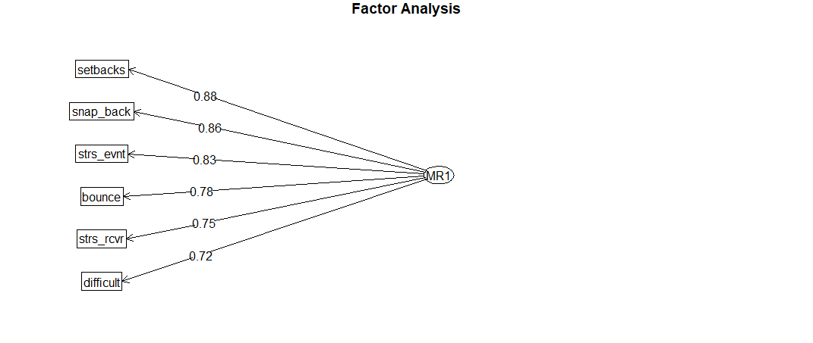
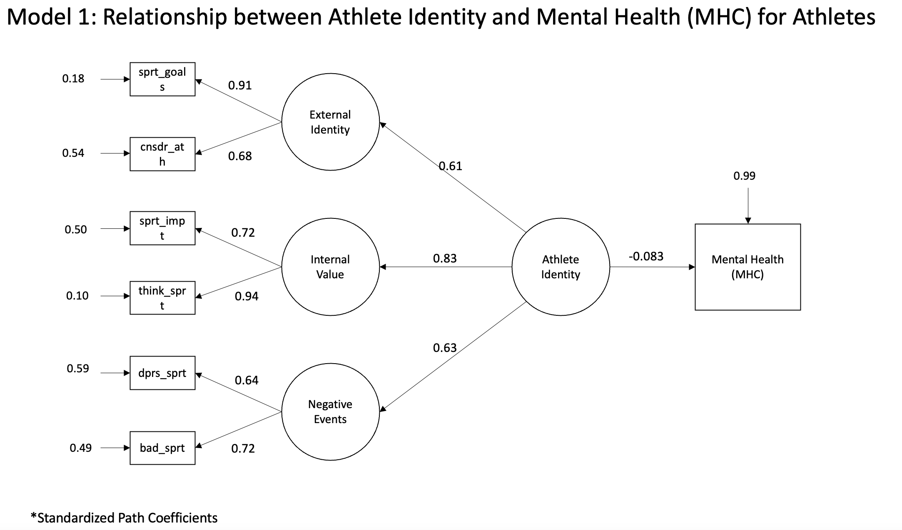

## Introduction

The onset of COVID-19 has influenced almost every sphere of work and leisure. The athletic industry in particular has been affected by the pandemic in interesting ways, as they exist at the intersection of work and leisure. Many sports events, including the 2020 Olympics, had been cancelled or postponed in an effort to mitigate the transmission of COVID-19, and recent studies have shown that lockdowns have had profound impacts on the psychological well-being of athletes$^{[2]}$. In this study, we sought to quantify the impact that a person's athletic identity, and other potentially mediating characteristics, may have had on their overall well-being in the context of a global pandemic.

## Dataset

The data that we used was collected by Christopher Knowles et al.$^{[1]}$, after the first COVID-19 lockdown in the United Kingdom in the summer of 2020. This dataset contains demographic information and responses to five surveys for athletes and non-athletes in the UK. In total, 753 individuals over the age of 18 were included, 363 of which indicated that they were athletes, and 390 indicated that they were not. A higher proportion of females were interviewed in the group of non-athletes than in the group of athletes, and the athletes tended to be younger than the non-athletes (Appendix 1). Most athletes interviewed were ball sport and track and field athletes (Appendix 2). For this study, we decided to focus our analysis on the athletes represented in this dataset, reserving the non-athletes for a comparison analysis.

### Measures of Interest

The following scales and variables were considered over the course of our analysis as observed variables of defined latent constructs of interest.

#### The Athletic Identity Measurement Scale (AIMS)

The Athletic Identity Scale$^{[5]}$ (Appendix 3) includes 6 items and is measured on a 7-point Likert scale from "strongly disagree" to "strongly agree". The participants indicate their agreements with each item. The latent variables that are within the observed variables in the scale itself were identified through factor analysis. The variables in this scale were hypothesized to be reflective of the latent construct athletic identity, which was the measure that we were primarily interested in.

#### The Mental Health Continuum Short Form (MHC-SF)

The outcome variable in this study is the sum score of responses from the Mental Health Continuum Short Form (MHC-SF)$^{[8]}$ (Appendix 4). This questionnaire measures emotional, social, and psychological well-being in its 14 items. Respondents were asked to indicate how often they experience the event asked in the prompt and their responses were coded from 0 to 5, based on the frequency of each event. Higher scores are associated with greater levels of positive well-being.

We elected to use the sum score of responses to thus questionnaire rather than each individual measure of well-being for a few reasons. As athletic identity is a construct that is should influence all dimensions of who an individual is, we wanted our measure of well-being to be a similarly comprehensive measure. Additionally, the nature of the total MHC-SF score being a observed, numeric value appealed to us. Though we considered using the three- or bi-factor latent variable structure that some researchers choose to use when employing the MHC-SF, the comparative ease of interpretability of having a measurable outcome variable seemed advantageous. Finally, we found that there is a precedent of use of the total MHC-SF score in previous research -- since this is a metric that has been used and found to be valid and consistent measure of overall well-being in a number of different studies$^{[9]}$, we felt comfortable with simply using the sum score as our outcome.

#### The Brief Resilience Scale (BRS)

The Brief Resilience Scale$^{[6]}$ (Appendix 5) was developed to measure a person's resilience through a set of six questions. Each these items are measured on a 5-point Likert scale, where respondents mark their level of agreement to a given prompt. Depending on the question asked, each response is scored from 1 to 5, where higher scores indicate greater amounts of resilience.

We were interested in this set of variables, as resilience is often thought of as a trait that high-performing athletes possess and endeavor to develop through their training. Furthermore, because resilience is also an attribute that has been identified to positively influence an individual's well-being$^{[3]}$, we hypothesized that this characteristic would exist on the causal pathway between athletic identity and overall well-being.

#### Healthy Lifestyle Measurements

The dataset we used also contained the following variables: a binary variable assessing whether the respondent typically consumes five fruits or vegetables in a day, an ordinal variable assessing the respondent's smoking habits, and a continuous variable measuring how many hours a sleep the respondent typically gets. At face value, these items appear to be measures of a healthy lifestyle, which piqued our interest as another potential mediating factor between athletic identity and overall well-being. Similarly to resilience, a healthy lifestyle has also been well-documented to be positively associated with an individual's well being$^{[4]}$ and also is a trait that is associated with athletes.

## Exploratory and Confirmatory Factor Analysis

### Latent Variable 1: Athletic Identity

Principal component analysis was first conducted on the seven AIMS variables collected in our dataset, from which a two-component latent structure was recommended (Appendix 6) and would explain 63.8% of the variation within the seven items. One-, two-, and three-factor models were then fit in exploratory factor analysis, from which the three-factor model was selected, using BIC and RMSEA as criteria for goodness-of-fit (Appendix 7, 8).

The three latent variables were named as follows: external identity, internal value, and negative events. The external identity latent construct corresponds with one's demonstrable identity as an athlete and was initially found to be reflected in the items "I consider myself an athlete", "I have many goals related to sport", and "Most of my friends are athletes". Internal value corresponds with how much someone values sports and was found to be reflected in the items "Sport is the most important part of my life" and "I spend more time thinking about sport than anything else". Finally, the negative events latent construct corresponds with how one would react to negative events that may happen to them in sports and is reflected in the items "I feel bad about myself when I do badly in sport" and "I would be very depressed if I were injured and could not compete in sport".

The Cronbach's alphas for internal value and negative events are 0.81 and 0.63 respectively, indicating that they possess reasonable internal consistency, and the output suggested that no observed variables could be dropped to improve reliability for these two factors. However, we observed that Chronbach's alpha would significantly improve for the external identity latent variable if the variable corresponding with the question "Are most of your friends athletes?" is removed its structure (Appendix 9), so this variable was dropped.

We also hypothesized that there may exist a second-order latent factor underlying the three latent variables identified and we conducted a confirmatory factor analysis to verify our hypothesis (Appendix 10). Because the model fit measures were adequate for this latent structure (CFI > 0.99, RMSEA < 0.05, $\chi^2$ p-value = 0.514), we concluded that there was enough evidence for the hypothesized structure to underlie the observed variables of interest, and decided to proceed by using the second-order latent in our SEM.

### Latent Variable 2: Resilience

We followed a similar process in representing resilience as a latent variable. After conducting principal component analysis, which recommended a one-component latent structure that would explain 64.0% of the variation within the six items (Appendix 11), we fit one- and two- factor models in exploratory factor analysis and compared their fits. The one-factor model was ultimately selected based on its lower BIC and parsimony (Appendix 12, 13).

We then assessed the internal consistency of this latent variable. This analysis produced a Chronbach's alpha of 0.89, which indicates that the items in the BRS are reliable measures of the latent variable resilience. In addition, all items were kept within the latent construct, as no items were suggested to be removed in the deleted alpha test. 

After this, we conducted a confirmatory factor analysis to evaluate the fit of the latent structure we had constructed. As the fit measures were all sufficient (CFI > 0.98, RMSEA < 0.08), and all factor loadings were indicated to be significant (Appendix 14), we concluded that this model fit the data adequately well.

### Latent Variable 3: Healthy Lifestyle

Finally, we endeavored to construct a latent variable that would reflect the "healthy lifestyle" measures that were collected in our dataset, as aforementioned. Similarly to the previous two latent constructs, we first conducted parallel component analysis (Appendix 15), in which a single component was recommended, though it would only explain 39.0% of the variability in the three items.

Both one- and two- factor models were then fit to the three items in exploratory factor analysis, from which both produced very poorly fit models. Though this inclined us to reconsider using this latent structure, we decided to perform a reliability analysis on the one-factor model to examine its internal consistency (Appendix 16).

Unsurprisingly, the Cronbach's alpha for this model was very low (-0.26) (Appendix 17), indicating that these three variables are not reliable measures of this latent variable. Upon seeing these results, we made the decision to not move forward with using this latent structure and excluded it from being used as a mediator between athletic identity and overall well-being. 

## Structural Equation Modeling

After establishing the athletic identity and resilience latent variables, we constructed a number of structural equation models to assess the strength of the association between athletic identity and overall well-being, with resilience acting as a mediator between the two. 

### Athletic Identity and Overall Well-Being

First, we constructed a structural equation model between athletic identity and overall well-being to examine the effect athletic identity has on the outcome without the presence of a mediating variable. Using the latent variable structure defined for athletic in confirmatory factor analysis, we constructed a simple regression path diagram between the two-factor latent variable and the outcome, MHC-SF composite score (Appendix 18). 

The resulting model revealed that the correlation between aspect of athletic identity and overall well-being is negative, though the p-value of this estimate was greater than 0.05. This indicates that there is not a significant association between athletic identity and overall well-being, at a 0.05 significance level, and we cannot reject the null hypothesis that the estimated effect of athletic identity on overall well-being is 0. 

### Athletic Identity and Overall Well-Being, Mediated by Resilience

We then constructed another model to examine the association between athletic identity and overall well-being, placing the resilience latent construct we defined in between the two as a mediating variable. 

Again, the resulting path analysis (Appendix 19) demonstrated a negative, but insignificant, correlation between athletic and well-being, as athletic identity was estimated to have a standardized direct effect of -0.084. A negative correlation between athletic identity and resilience also existed, which was not statistically significant at the 0.05 significance level (p = 0.054). 

Though athletic identity did not have significant correlations with the other two variables in the model, resilience was shown to have had a significant correlation with overall well-being. This indicates that increased levels of resilience tend to be associated with improved overall well-being (Appendix 20).  

The standardized indirect effect from athletic identity to overall well-being was -0.056, which also proved to be insignificant at the 0.05 significance level. 

Ultimately, the results from this model demonstrate that resilience did not mediate the effect of athletic identity on overall well-being, and athletic identity again did not significantly impact overall well-being. Resilience, however, does appear to have a significant effect on overall well-being.

### Athletic Identity and Overall Well-Being, Mediated by Resilience, and According to Athlete Status

We then conducted a series of regressions to test if there are any differences that exist in the effects of athletic identity, resilience, and overall well-being between athletes and non-athletes (Appendix 21). To do so, we constructed two structural equation models associating athletic identity with MHC-SF composite score and mediated by resilience; one using the portion of the dataset corresponding to responses from athletes and the other using the portion of the dataset corresponding to responses from non-athletes. These models were constructed to report unstandardized coefficients in order to assist in comparing the results between these two groups.

As expected, the correlations between the model variables were different for athletes and non-athletes. The SEM for non-athletes indicated a stronger correlation between athletic identity and overall well-being than the SEM for athletes did. For non-athletes, the coefficient between athletic identity and overall well-being was -1.657, and was indicated to be significant, where as the corresponding association for athletes was much smaller in magnitude and insignificant. 

Resilience had significant correlation with overall well-being for both athletes and non-athletes. The estimated indirect and direct effect of athletic identity on overall well-being are not significant for both athletes and non-athletes. The result indicated that mediation effect of resilience in both groups are not significant at 0.05 significance level (Appendix 22, 23).

## Discussion

Though the constructed models indicated consistently insignificant effect estimates between athletic identity and overall well-being for athletes, the estimated effects between these two variables were consistently negative, with and without the presence of resilience as the mediator between the two. The significant negative association between athletic identity and overall well-being between non-athletes seems to make this phenomenon more pronounced. Given the context of this survey, a lack of access to one's sport is a possible explanation for the negative effect athletic identity seems to be producing on overall well-being. Individuals who have a stronger athletic identity may have felt a greater frustration than individuals with a weaker athletic identity during the COVID-19 lockdowns, as it may have become more inconvenient or entirely impossible to participate in sports as they had been accustomed to.

The differences in direct effects between athletic identity and overall well-being between athletes and non-athletes was notable in our structural equation modeling. Non-athletes appeared to have had athletic identity affect their overall well-being nearly 2.5 times more negatively than athletes. Perhaps one possible explanation for the well-being of non-athletes being affected far more than the well-being of athletes by one's reported athletic identity is that though COVID-19 made the experience of playing a sport different universally, athletes may have had more resources at their disposal to cope with the changes. For example, an athlete may have individuals around them, such as coaches and other athletic professionals, who would be able to support them or even keep them accountable to their training regimen. On the other hand, non-athletes may have had a more difficult time maintaining a community of similarly minded individuals around them, and may have had a more difficult time adjusting to the striking change of pace the COVID-19 lockdowns may have brought about.

Our findings for resilience were the least surprising, as the positive association with overall well-being that we noticed in our analysis agrees with previous research that has been conducted. Resilience did seem to have a greater positive effect on overall well-being for non-athletes than it did for athletes, but was still noted to be the variable with the greatest influence on overall well-being in both models. 

## Limitations and Recommendations for Further Study

Perhaps the biggest limitation of our analysis is that there likely exist more variables between the causal pathways we have defined between athletic identity, resilience, and overall well-being, and such mediating relationships may be very complex. In addition, confounding characteristics, such as demographic attributes, were also excluded from our analysis and models. We would recommend future analysis to assess the effects such confounders may have had on the variables we have analyzed and additionally investigate whether any additional factors may mediate the effect of athletic identity to overall well-being in significant ways.

Additionally, we would recommend that the latent variable measuring healthy lifestyles be revisited in future studies. We propose that it may be worthwhile to consider this latent variable to be a formative (rather than reflective) construct, as this may more accurately reflect its nature and allow this variable to be used in a SEM. 

Finally, though this study is in agreement with research that has been conducted regarding the positive effect resilience has on one's overall well-being, the act of developing resilience implicitly requires undergoing some sort of adverse event. Often, resilience is a characteristic that is paired with the experience of trauma. Thus, while making efforts to bolster one's resilience may be something to consider, some exercises to do so may be more risky than they would be beneficial. 

\newpage

## References

1. Knowles, C., Breslin, G., Shannon, S., & Prentice, G.. (2020). Athlete_Non-Athlete MH Survey - ALL DATA.csv.figshare. 

2. Uroh, C., & Adewunmi, C. (2021). Psychological Impact of the COVID-19 Pandemic on Athletes. Frontiers In Sports And Active Living, 3. doi: 10.3389/fspor.2021.603415

3.  Hu, T., Zhang, D., & Wang, J. (2014, December 13). A meta-analysis of the Trait Resilience and Mental Health. Personality and Individual Differences. <https://www.sciencedirect.com/science/article/pii/S0191886914006710>

4.  Dale, H., Brassington, L., & King, K. (2014, March 5). The impact of healthy lifestyle interventions on Mental Health and Wellbeing: A systematic review. Mental Health Review Journal. <https://www.emerald.com/insight/content/doi/10.1108/MHRJ-05-2013-0016/full/html>

5.  A cross-cultural psychometric evaluation of the Athletic Identity Measurement Scale. Taylor & Francis. (n.d.). <https://www.tandfonline.com/doi/full/10.1080/10413200802415048>

6.  The brief resilience scale. Evaluating wellbeing. (2021, March 15). <https://measure.whatworkswellbeing.org/measures-bank/brief-resilience-scale/>

7.  Fung S. F. (2020). Validity of the Brief Resilience Scale and Brief Resilient Coping Scale in a Chinese Sample. International journal of environmental research and public health, 17(4), 1265. <https://doi.org/10.3390/ijerph17041265>

8.  Mental health continuum short form. Lee Kum Sheung Center for Health and Happiness. (2022, March 16). <https://www.hsph.harvard.edu/health-happiness/mental-health-continuum-short-form/>

9.  Hides, L., Quinn, C., Stoyanov, S., Cockshaw, W., Mitchell, T., & Kavanagh, D. J. (2016, April 23). Is the mental wellbeing of young Australians best represented by a single, multidimensional or bifactor model? Psychiatry Research. <https://www.sciencedirect.com/science/article/pii/S0165178115305758>

\newpage

## Appendices

Appendix 1: Athletes and Non-Athletes Demographics

Appendix 2: Athletes and Non-Athletes Sports Played

Appendix 3: The Athletic Identity Measurement Scale (AIMS)

Appendix 4: The Mental Health Continuum Short Form (MHC-SF)

Appendix 5: The Brief Resilience Scale (BRS)

Appendix 6: Athletic Identity PCA

Appendix 7: Athletic Identity EFA 3-Factor Model

Appendix 8: Athletic Identity EFA Fit Measures

Appendix 9: External Identity Reliability

Appendix 10: Athletic Identity CFA Loadings

Appendix 11: Resilience PCA

Appendix 12: Resilience EFA

Appendix 13: Resilience EFA Fit Measures

Appendix 14: Resilience CFA Loadings

Appendix 15: Healthy Lifestyle PCA

Appendix 16: Healthy Lifestyle EFA

Appendix 17: Healthy Lifestyle Reliability

Appendix 18: Athletic Identity and Overall Well-Being

Appendix 19: Resilience Mediating SEM

Appendix 20: Resilience Mediating SEM with Standardized Effects

Appendix 21: Athlete and Non-Athlete Comparison SEM

Appendix 22: Unstandardized Effects of Athletic Identity, Athletes

Appendix 23: Unstandardized Effects of Athletic Identity, Non-Athletes

Appendix 24: GitHub Repository

\newpage

\centering

### Appendix 1: Athletes and Non-Athletes Demographics

### Appendix 2: Athletes and Non-Athletes Sports Played

### Appendix 3: The Athletic Identity Measurement Scale (AIMS)

### Appendix 4: The Mental Health Continuum Short Form (MHC-SF)

### Appendix 5: The Brief Resilience Scale (BRS)

### Appendix 6: Athletic Identity PCA

### Appendix 7: Athletic Identity EFA 3-Factor Model

### Appendix 8: Athletic Identity EFA Fit Measures

### Appendix 9: External Identity Reliability

### Appendix 10: Athletic Identity CFA Loadings

### Appendix 11: Resilience PCA

### Appendix 12: Resilience EFA

### Appendix 13: Resilience EFA Fit Measures

### Appendix 14: Resilience CFA Loadings

### Appendix 15: Healthy Lifestyle PCA

### Appendix 16: Healthy Lifestyle EFA

### Appendix 17: Healthy Lifestyle Reliability

### Appendix 18: Athletic Identity and Overall Well-Being

### Appendix 19: Resilience Mediating SEM

### Appendix 20: Resilience Mediating SEM with Standardized Effects

### Appendix 21: Athlete and Non-Athlete Comparison SEM

### Appendix 22: Unstandardized Effects of Athletic Identity, Athletes

### Appendix 23: Unstandardized Effects of Athletic Identity, Non-Athletes

### Appendix 24: GitHub Repository

All of the code for this study can be found in [this](https://github.com/waveley/p8158_final) GitHub repository.

